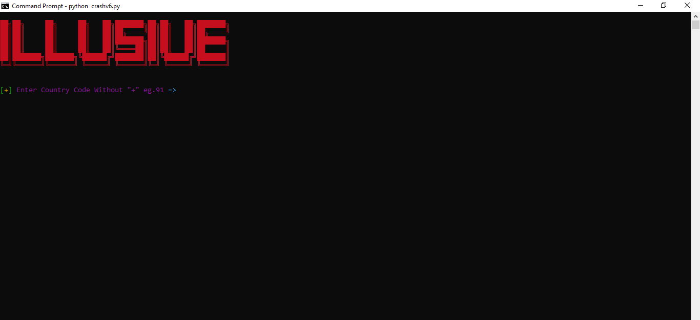

# 🚀 WhatsApp Crash Bot

A Python script that automates sending messages to a specific WhatsApp number, designed to simulate a high volume of message delivery. Use responsibly and ensure compliance with applicable laws.

---

## 🖼️ Screenshot




---

## 🌟 Features
- Automated messaging on WhatsApp Web.
- User-friendly inputs for country code, phone number, and crash count.
- Visual design enhancements using `colorama`.
- Automated Chrome WebDriver setup using `webdriver_manager`.

---

## 📋 Prerequisites
- Python 3.8 or later installed on your system.
- Google Chrome browser installed.
- Required Python libraries:
  - `selenium`
  - `colorama`
  - `webdriver_manager`

Install the dependencies using:
bash
````pip install selenium colorama webdriver-manager````


🚀 How to Run
Clone the repository:
bash
````git clone ````

````cd whatsapp-crash-bot````


Run the script:
bash
````python whatsapp_crash_bot.py````

Follow the prompts:

Enter the country code (without +).
Enter the target phone number.
Specify the number of messages to send (maximum 15 within 30 minutes).
Confirm the details and let the script do its work!

⚠️ Disclaimer
This tool is for educational purposes only.
Do not use this script to harass, harm, or inconvenience others. Ensure you have the recipient's consent before sending messages.


🛠️ How It Works
Initialization:

Sets up the Chrome WebDriver.
Uses colorama for colorful CLI outputs.
Inputs:

Collects country code, phone number, and crash count from the user.
Automation:

Navigates to WhatsApp Web and opens a chat with the specified number.

Sends the message the specified number of times using selenium.

📝 Author.
Illusivehacks
Feel free to connect or report issues via GitHub or Gmail -> williamkitungo@gmail.com
